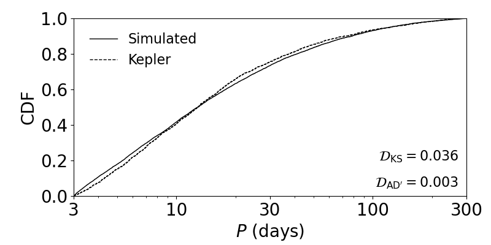

Comparing catalogs
===================

Computing KS distances
----------------------

Plotting histograms and CDFs are a great way of visually comparing different models and the data. However, a more quantitative way of comparing distributions is possible using various distance measures. A widely used and intuitively simple distance function is the `two-sample Kolmogorov-Smirnov (KS) distance <https://en.wikipedia.org/wiki/Kolmogorov–Smirnov_test>`_, which is simply defined as the maximum difference between two CDFs. We have two functions that compute the KS distance, one for discrete distributions and one for continuous distributions:

.. code-block:: python

   # Load modules and catalogs as before:
   from syssimpyplots.general import *
   from syssimpyplots.load_sims import *
   from syssimpyplots.plot_catalogs import *
   from syssimpyplots.compare_kepler import *

   load_dir = '/path/to/a/simulated/catalog/' # replace with your path!

   N_sim, cos_factor, P_min, P_max, radii_min, radii_max = read_targets_period_radius_bounds(load_dir + 'periods.out')

   sss_per_sys, sss = compute_summary_stats_from_cat_obs(file_name_path=load_dir)
   ssk_per_sys, ssk = compute_summary_stats_from_Kepler_catalog(P_min, P_max, radii_min, radii_max)

   # Compute the KS distance between two multiplicity distributions:
   d_KS, x_KS = KS_dist_mult(sss_per_sys['Mtot_obs'], ssk_per_sys['Mtot_obs'])

   # Compute the KS distance between two period distributions:
   d_KS, x_KS = KS_dist(sss['P_obs'], ssk['P_obs'])

Both functions return the KS distance (``d_KS``) as well as the x-value corresponding to that distance (``x_KS``, i.e. where the difference in the CDFs is the greatest).

Computing AD distances
----------------------

Another well known distance is the `two-sample Anderson-Darling (AD) distance <https://en.wikipedia.org/wiki/Anderson–Darling_test>`_, which computes an integral over the difference of two CDFs (weighted towards the tails). This measure is more sensitive to differences in the extremes of the distributions. However, we found that samples with vastly different sizes (e.g., numbers of planets) can still produce low AD distances (see Section 2.4.2 of `He et al. 2019 <https://arxiv.org/pdf/1907.07773.pdf>`_ for further discussion). Thus, we also define a "modified" AD distance which re-normalizes by (divides out) the constant in front of the integral, `n*m/N` where `n` and `m` are the sample sizes (and `N=n+m`):

.. code-block:: python

   # Compute the standard AD distance between two period distributions:
   d_AD = AD_dist(sss['P_obs'], ssk['P_obs'])

   # Compute the modified AD distance between two period distributions:
   d_ADmod = AD_mod_dist(sss['P_obs'], ssk['P_obs'])

Labeling distances on CDF plots
-------------------------------

The function for plotting the CDFs of continuous distributions shown on the previous page also allows for the optional parameter ``label_dist``, which can be set to ``True`` to also compute and print the KS and (modified) AD distances on the figure:

.. code-block:: python

   # To plot a CDF of the observed orbital periods, with KS and AD (modified) distances shown:
   ax = plot_fig_cdf_simple(fig_size, [sss['P_obs']], [ssk['P_obs']], x_min=3., x_max=300., log_x=True, xticks_custom=[3,10,30,100,300], xlabel_text=r'$P$ (days)', legend=True, label_dist=True)

   plt.show()

   The observed period CDFs for a simulated and the Kepler catalog.

Summing multiple distances
--------------------------

As we have shown, it is relatively easy to compare two distributions by computing distances between them. It is much harder to compare two *catalogs*, which can be characterized by many distributions and summary statistics, including but not limited to the total number of planets per star and the 1-d ("marginal") distributions of various planetary properties (not to mention correlations in 2-d and higher dimensions!). The simulations are also stochastic, so there are statistical variations in the simulated catalogs and thus the distances, even for the same model with the exact same parameters!

A reasonable approach is to sum the distances computed between multiple marginal distributions that we care about, for example the observed multiplicities, orbital periods, period ratios,... etc. using a "distance function" (see our :ref:`publications <publications>` for more details about the distance functions we have used). However, some distances are naturally larger or exhibit more variance compared to others, and so we cannot just sum the distance terms directly. For example, how do you compare the change in one distance term (e.g., for the orbital periods) with the change in another (e.g., for the transit duration ratios)? We must weight each term in some manner.

One idea is to simulate many iterations of catalogs of the same model, and compute the distances for each of the marginal distributions between each unique pair of catalogs (see e.g. Section 2.2.2 of `He et al. 2021a <https://arxiv.org/pdf/2003.04348.pdf>`_ for more details). The distances obtained in this way give us an idea of the typical distances for each summary statistic when you have a "perfect" model, and can be used as the weights for summing different distance terms. Below is an illustrative example of how you can do this using some pre-computed weights that we have provided.

.. code-block:: python

   # To load a file with pre-computed weights:
   weights_all = load_split_stars_weights_only()

   # To pick a specific set of distance terms to include:
   dists_include = ['delta_f',
                    'mult_CRPD_r',
                    'periods_KS',
                    'durations_KS',
                    'depths_KS']

   # To compute many distance terms:
   dists, dists_w = compute_distances_sim_Kepler(sss_per_sys, sss, ssk_per_sys, ssk, weights_all['all'], dists_include, N_sim)

Here, 'delta_f' refers to the distance for the total number of observed planets relative to the number of stars, 'mult_CRPD_r' refers to the Cressie-Read Power Divergence (CRPD; see :py:func:`CRPD_dist <syssimpyplots.compare_kepler.CRPD_dist>`) statistic for comparing the multiplicity distributions, and the remaining items refer to the KS distances for the distributions of periods, transit durations, and transit depths. The function :py:func:`compute_distances_sim_Kepler <syssimpyplots.compare_kepler.compute_distances_sim_Kepler>` will print out the weights and distances for each of these terms, and also compute many other distances to be included in the outputs ``dists`` (raw distance terms) and ``dists_w`` (weighted distance terms)!

.. caution::

   The function :py:func:`compute_distances_sim_Kepler <syssimpyplots.compare_kepler.compute_distances_sim_Kepler>` also enables you to compute the unmodified AD distances if you pass ``AD_mod=False`` (default is ``True``). However, the weights were computed for the ``AD_mod=True`` only, so the weighted distances should not be used in that case.
