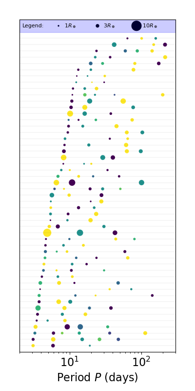
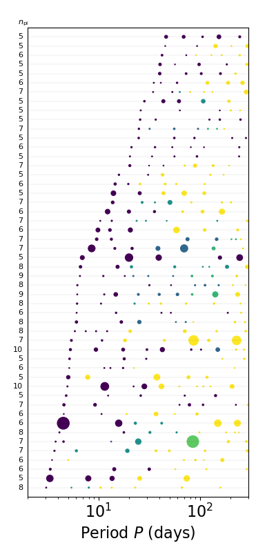

Visualizing catalogs
====================

Another way to visualize the catalogs is to plot *galleries* of their individual systems, where the planets in each system are plotted as points on a line along the orbital period axis (or semi-major axis). This is especially useful for looking at the multi-planet systems and their architectures.

Plotting a simple gallery
-------------------------

Here is a simple example using our function :py:func:`plot_figs_observed_systems_gallery_from_cat_obs <syssimpyplots.plot_catalogs.plot_figs_observed_systems_gallery_from_cat_obs>` to plot a gallery of systems with three or more observed planets:

.. code-block:: python

   # Load modules and catalogs as before:
   from syssimpyplots.general import *
   from syssimpyplots.load_sims import *
   from syssimpyplots.plot_catalogs import *
   from syssimpyplots.compare_kepler import *

   load_dir = '/path/to/a/simulated/catalog/' # replace with your path!

   N_sim, cos_factor, P_min, P_max, radii_min, radii_max = read_targets_period_radius_bounds(load_dir + 'periods.out')

   # Load a simulated physical catalog:
   sssp_per_sys, sssp = compute_summary_stats_from_cat_phys(file_name_path=load_dir, load_full_tables=True, match_observed=True)

   # Load simulated and Kepler observed catalogs:
   sss_per_sys, sss = compute_summary_stats_from_cat_obs(file_name_path=load_dir)
   ssk_per_sys, ssk = compute_summary_stats_from_Kepler_catalog(P_min, P_max, radii_min, radii_max)

   # Plot a gallery of the simulated systems with 3+ observed planets:
   plot_figs_observed_systems_gallery_from_cat_obs(sss_per_sys, sort_by='inner', n_min=3, color_by='k', max_sys=50, sys_per_fig=50)
   plt.show()

This function can be applied to both simulated observed (e.g. ``sss_per_sys``) and Kepler-observed (e.g. ``ssk_per_sys``) catalogs. In this example, we have sorted the systems by the period of their inner-most planet, and included 50 systems in a single figure.

.. tip::

   You can change the number of systems, and/or the number of figures, plotted by varying the ``max_sys`` and ``sys_per_fig`` parameters. For example, setting ``max_sys=200`` and ``sys_per_fig=50`` will make four figures each showing 50 different systems (if there are enough systems with the required multiplicity in the catalog).

The ``color_by`` parameter allows you to choose from a number of color schemes. For example, you can also the planets by their relative size order in each system (so all the smallest planets are one color, all the 2nd smallest planets are another color, etc.):

.. code-block:: python

   # Plot a gallery with the planets colored by their size ordering:
   plot_figs_observed_systems_gallery_from_cat_obs(sss_per_sys, sort_by='inner', n_min=3, color_by='size_order', max_sys=50, sys_per_fig=50)
   plt.show()

Sorting and labeling systems
----------------------------

You can also sort by planet multiplicity instead of inner-most period by setting ``sort_by='multiplicity'``, and label each system by a given quantity by setting ``llabel`` and ``llabel_text`` such as in the following example:

.. code-block:: python

   # Plot a gallery with the systems sorted and labeled by multiplicity:
   plot_figs_observed_systems_gallery_from_cat_obs(sss_per_sys, sort_by='multiplicity', n_min=3, color_by='size_order', llabel='multiplicity', llabel_text=r'$n_{\rm pl}$', max_sys=50, sys_per_fig=50)
   plt.show()

.. tip::

   The label does not have to be the same as or even related to the ``sort_by`` parameter, but it's useful for checking that it has actually sorted things correctly.

Plotting detected/undetected planets
------------------------------------

There is a separate function for plotting galleries of physical systems, :py:func:`plot_figs_physical_systems_gallery_from_cat_phys <syssimpyplots.plot_catalogs.plot_figs_physical_systems_gallery_from_cat_phys>`. It provides much of the same functionality and uses mostly the same parameters, except it allows you to filter systems based on both the intrinsic multiplicity (using ``n_min`` and ``n_max``) as well as the observed multiplicity (using ``n_det_min`` and ``n_det_max``). It also contains more options for ``color_by``, and has a ``mark_det`` boolean parameter for whether or not to indicate the detected and undetected planets. The following examples showcase some of these options:

.. code-block:: python

   # Plot a gallery of physical systems with at least 5 planets:
   plot_figs_physical_systems_gallery_from_cat_phys(sssp_per_sys, sssp, sort_by='inner', n_min=5, n_det_min=0, color_by='cluster', mark_det=False, llabel='multiplicity', llabel_text=r'$n_{\rm pl}$', max_sys=50, sys_per_fig=50)

   # Plot a gallery of physical systems with at least two detected planets:
   plot_figs_physical_systems_gallery_from_cat_phys(sssp_per_sys, sssp, sort_by='inner', n_det_min=2, color_by='k', mark_det=True, llabel='multiplicity', llabel_text=r'$n_{\rm pl}$', max_sys=50, sys_per_fig=50)

   plt.show()

|gallery_phys1| |gallery_phys2|

In the left figure, we selected only systems with at least five planets (regardless of whether or not any planets are detected) and colored them by their cluster id's, so planets with the same color were drawn from the same "cluster".

In the right figure, we selected systems with at least two detected planets and marked all undetected planets with red outlines using the ``mark_det=True`` option.
