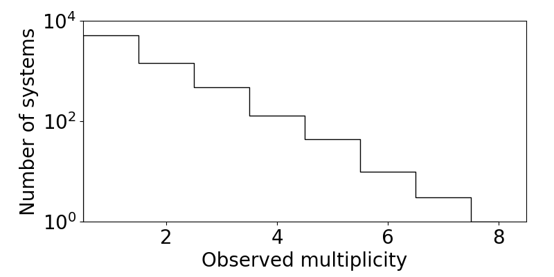
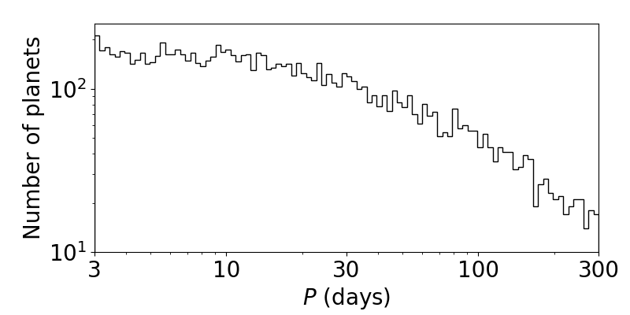
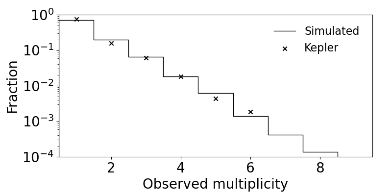
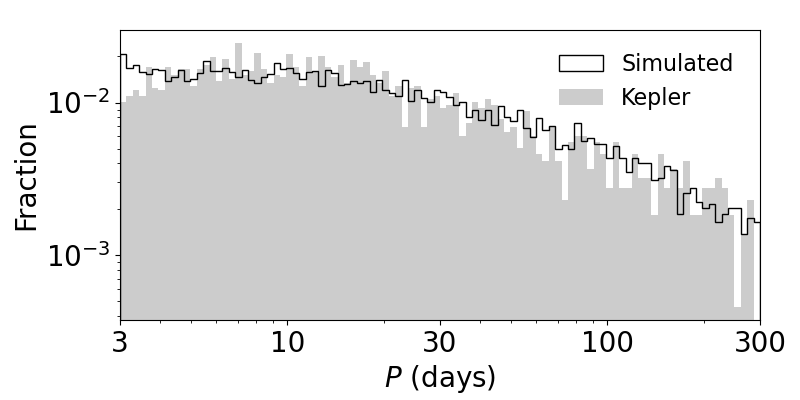
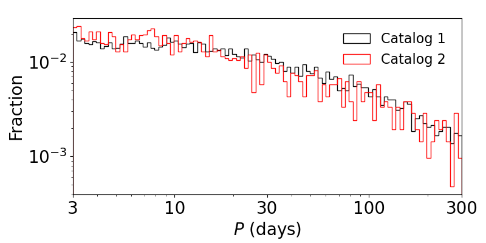
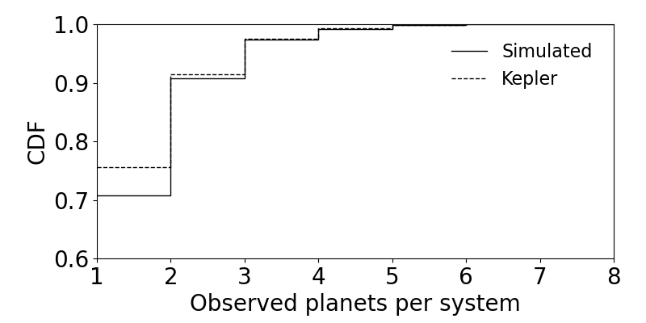
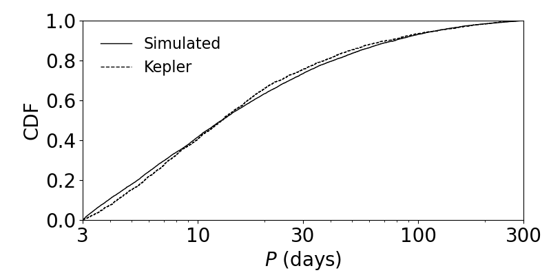

Plotting histograms
===================

A simple example
----------------

On the previous page, you learned how to load a catalog (physical and observed). These catalogs are in the form of dictionaries containing various planetary (and stellar) properties (sometimes referred to as *summary statistics*). One of the most basic and yet illuminating ways of visualizing a catalog is to plot histograms of the various properties. We provide several flexible functions for plotting histograms:

.. code-block:: python

   import numpy as np
   from syssimpyplots.general import *
   from syssimpyplots.load_sims import *
   from syssimpyplots.plot_catalogs import *
   from syssimpyplots.compare_kepler import *

   load_dir = '/path/to/a/simulated/catalog/' # replace with your path!

   sss_per_sys, sss = compute_summary_stats_from_cat_obs(file_name_path=load_dir)

   fig_size = (8,4) # size of each figure (width, height)

   # To plot a histogram of the observed multiplicities (number of planets per system):
   ax = plot_fig_counts_hist_simple(fig_size, [sss_per_sys['Mtot_obs']], [], x_min=0, x_max=8, x_llim=0.5, log_y=True, xlabel_text='Observed multiplicity', ylabel_text='Number of systems')

   # To plot a histogram of the observed orbital periods:
   ax = plot_fig_pdf_simple(fig_size, [sss['P_obs']], [], x_min=3., x_max=300., normalize=False, log_x=True, log_y=True, xticks_custom=[3,10,30,100,300], xlabel_text=r'$P$ (days)', ylabel_text='Number of planets')

   plt.show()

   The observed multiplicity distribution of a simulated catalog.

   The observed period distribution of a simulated catalog.

As demonstrated above, the :py:func:`plot_fig_counts_hist_simple` function should be used for quantities taking on discrete, integer values, as it is designed to center each bin on an integer. The multiplicity distribution is a perfect example of this case!

For continuous distributions (such as the period distribution), the :py:func:`plot_fig_pdf_simple` function should be used.

.. tip::

   The two functions above are actually wrappers of the functions :py:func:`plot_panel_counts_hist_simple` and :py:func:`plot_panel_pdf_simple`, respectively, which do most of the work and create a single panel (requiring an axes subplot object to plot on) instead of a figure. These are useful for making multi-panel figures!

Plotting multiple catalogs
--------------------------

The third argument (empty list ``[]`` in the above examples) allows you to easily over-plot the Kepler catalog with a simulated observed catalog. Here is an example:

.. code-block:: python

   N_sim, cos_factor, P_min, P_max, radii_min, radii_max = read_targets_period_radius_bounds(load_dir + 'periods.out')

   # Load the Kepler catalog first:
   ssk_per_sys, ssk = compute_summary_stats_from_Kepler_catalog(P_min, P_max, radii_min, radii_max)

   # To plot a histogram of the observed multiplicities (number of planets per system):
   ax = plot_fig_counts_hist_simple(fig_size, [sss_per_sys['Mtot_obs']], [ssk_per_sys['Mtot_obs']], x_min=0, x_max=9, y_max=1, x_llim=0.5, normalize=True, log_y=True, xlabel_text='Observed multiplicity', ylabel_text='Fraction', legend=True)

   # To plot a histogram of the observed orbital periods:
   ax = plot_fig_pdf_simple(fig_size, [sss['P_obs']], [ssk['P_obs']], x_min=3., x_max=300., log_x=True, log_y=True, xticks_custom=[3,10,30,100,300], xlabel_text=r'$P$ (days)', legend=True)

   plt.show()

   The observed multiplicity distribution of a simulated catalog compared to the Kepler catalog.

   The observed period distribution of a simulated catalog compared to the Kepler catalog.

Note that we've set ``legend=True`` to tell which is which! The ``normalize=True`` option is also useful when the catalogs have different numbers of systems (in this case, the simulated catalog has five times as many targets as the Kepler catalog).

You can also plot multiple simulated (and Kepler) catalogs simultaneously by simply adding them to the lists:

.. code-block:: python

   # Load two separate simulated-observed catalogs,
   # both of which are in the same 'load_dir',
   # with run numbers '1' and '2'.
   sss_per_sys1, sss1 = compute_summary_stats_from_cat_obs(file_name_path=load_dir, run_number='1')
   sss_per_sys2, sss2 = compute_summary_stats_from_cat_obs(file_name_path=load_dir, run_number='2')

   # To plot histograms of the observed orbital periods:
   ax = plot_fig_pdf_simple(fig_size, [sss1['P_obs'], sss2['P_obs']], [], x_min=3., x_max=300., log_x=True, log_y=True, c_sim=['k','r'], ls_sim=['-','-'], labels_sim=['Catalog 1', 'Catalog 2'], xticks_custom=[3,10,30,100,300], xlabel_text=r'$P$ (days)', legend=True)

   plt.show()

   The observed period distributions of two simulated catalogs.

.. note::

   You also need to pass lists for the optional arguments ``c_sim``, ``ls_sim``, and ``labels_sim`` to define the color, line-style, and legend label, respectively, for each catalog that you are plotting!

Plotting CDFs
-------------

Similarly, we also provide the following functions for plotting cumulative distribution functions (CDFs):

.. code-block:: python

   # To plot a CDF of the observed multiplicities:
   ax = plot_fig_mult_cdf_simple(fig_size, [sss_per_sys['Mtot_obs']], [ssk_per_sys['Mtot_obs']], y_min=0.6, y_max=1., xlabel_text='Observed planets per system', legend=True)

   # To plot a CDF of the observed orbital periods:
   ax = plot_fig_cdf_simple(fig_size, [sss['P_obs']], [ssk['P_obs']], x_min=3., x_max=300., log_x=True, xticks_custom=[3,10,30,100,300], xlabel_text=r'$P$ (days)', legend=True)

   plt.show()

   The observed multiplicity CDFs for a simulated and the Kepler catalog.

   The observed period CDFs for a simulated and the Kepler catalog.

Comparing catalogs
------------------

Plotting histograms and CDFs are a great way of visually comparing different models and the data. However, a more quantitative way of comparing distributions is possible using various distance measures. A widely used and intuitively simple distance function is the `two-sample Kolmogorov-Smirnov (KS) distance <https://en.wikipedia.org/wiki/Kolmogorov–Smirnov_test>`_, which is simply defined as the maximum difference between two CDFs. We have two functions that compute the KS distance, one for discrete distributions and one for continuous distributions:

.. code-block:: python

   # Compute the KS distance between two multiplicity distributions:
   d_KS, x_KS = KS_dist_mult(sss_per_sys['Mtot_obs'], ssk_per_sys['Mtot_obs'])

   # Compute the KS distance between two period distributions:
   d_KS, x_KS = KS_dist(sss['P_obs'], ssk['P_obs'])

Both functions return the KS distance (``d_KS``) as well as the x-value corresponding to that distance (``x_KS``, i.e. where the difference in the CDFs is the greatest).

Another well known distance is the `two-sample Anderson-Darling (AD) distance <https://en.wikipedia.org/wiki/Anderson–Darling_test>`_, which computes an integral over the difference of two CDFs (weighted towards the tails). While this measure is more sensitive to differences in the extremes of the distributions, we found that samples with vastly different sizes (e.g., numbers of planets) can still produce low AD distances (see Section 2.4.2 of `He et al. 2019 <https://arxiv.org/pdf/1907.07773.pdf>`_ for further discussion). Thus, we also define a "modified" AD distance which re-normalizes by (divides out) the constant in front of the integral, `n*m/N` where `n` and `m` are the sample sizes (and `N=n+m`):

.. code-block:: python

   # Compute the standard AD distance between two period distributions:
   d_AD = AD_dist(sss['P_obs'], ssk['P_obs'])

   # Compute the modified AD distance between two period distributions:
   d_ADmod = AD_mod_dist(sss['P_obs'], ssk['P_obs'])
