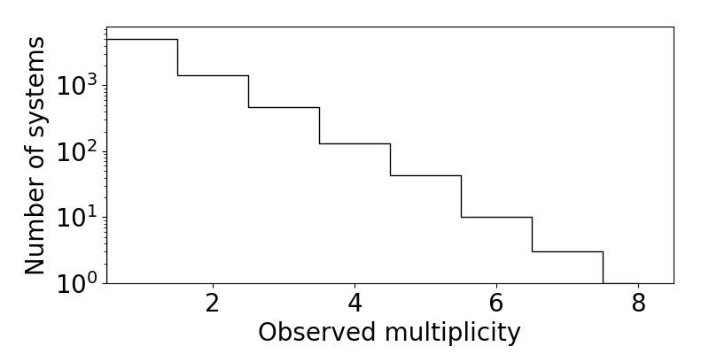

Plotting histograms
===================

.. note::

   Currently under construction!

On the previous page, you learned how to load a catalog (physical and observed). These catalogs are in the form of dictionaries containing various planetary (and stellar) properties (sometimes referred to as *summary statistics*). One of the most basic and yet illuminating ways of visualizing a catalog is to plot histograms of the various properties. We provide several flexible functions for plotting histograms:

.. code-block:: python

   import numpy as np
   from syssimpyplots.general import *
   from syssimpyplots.load_sims import *
   from syssimpyplots.plot_catalogs import *
   from syssimpyplots.compare_kepler import *

   load_dir = '/path/to/a/simulated/catalog/' # replace with your path!

   sss_per_sys, sss = compute_summary_stats_from_cat_obs(file_name_path=load_dir)

   fig_size = (8,4) # size of each figure (width, height)

   # To plot a histogram of the observed multiplicities (number of planets per system):
   ax = plot_fig_counts_hist_simple(fig_size, [sss_per_sys['Mtot_obs']], [], x_min=0, x_max=8, y_min=1, y_max=1e4, x_llim=0.5, log_y=True, xlabel_text='Observed multiplicity', ylabel_text='Number of systems')

   # To plot a histogram of the observed orbital periods:
   ax = plot_fig_pdf_simple(fig_size, [sss['P_obs']], [], x_min=3., x_max=300., y_min=10, y_max=250, normalize=False, log_x=True, log_y=True, xticks_custom=[3,10,30,100,300], xlabel_text=r'$P$ (days)', ylabel_text='Number of planets')

   plt.show()

   The observed multiplicity distribution of a simulated catalog.

   The observed period distribution of a simulated catalog.

As demonstrated above, the :py:func:`plot_fig_counts_hist_simple` function should be used for quantities taking on discrete, integer values, as it is designed to center each bin on an integer. The multiplicity distribution is a perfect example of this case!

For continuous distributions (such as the period distribution), the :py:func:`plot_fig_pdf_simple` function should be used.

.. tip::

   The two functions above are actually wrappers of the functions :py:func:`plot_panel_counts_hist_simple` and :py:func:`plot_panel_pdf_simple`, respectively, which do most of the work and create a single panel (requiring an axes subplot object to plot on) instead of a figure. These are useful for making multi-panel figures!

Plotting multiple catalogs
--------------------------

Here is a example of how to over-plot the Kepler catalog with an observed catalog:

.. code-block:: python

   # To plot a histogram of the observed multiplicities (number of planets per system):
   ax = plot_fig_counts_hist_simple(fig_size, [sss_per_sys['Mtot_obs']], [ssk_per_sys['Mtot_obs']], x_min=0, x_max=9, y_max=1, x_llim=0.5, normalize=True, log_y=True, xlabel_text='Observed multiplicity', ylabel_text='Fraction', legend=True)

   # To plot a histogram of the observed orbital periods:
   ax = plot_fig_pdf_simple(fig_size, [sss['P_obs']], [ssk['P_obs']], x_min=3., x_max=300., y_min=1e-3, y_max=0.03, log_x=True, log_y=True, xticks_custom=[3,10,30,100,300], xlabel_text=r'$P$ (days)')

Plotting CDFs
-------------

Similarly, you can use the following functions to plot (empirical) cumulative distribution functions (CDFs):

.. code-block:: python

   # To plot a CDF of the observed multiplicities:
   ax = plot_fig_mult_cdf_simple(fig_size, [sss_per_sys['Mtot_obs']], [], y_min=0.6, y_max=1., xlabel_text='Observed planets per system')

   # To plot a CDF of the observed orbital periods:
   ax = plot_fig_cdf_simple(fig_size, [sss['P_obs']], [], x_min=3., x_max=300., log_x=True, xticks_custom=[3,10,30,100,300], xlabel_text=r'$P$ (days)')

Comparing catalogs
------------------
